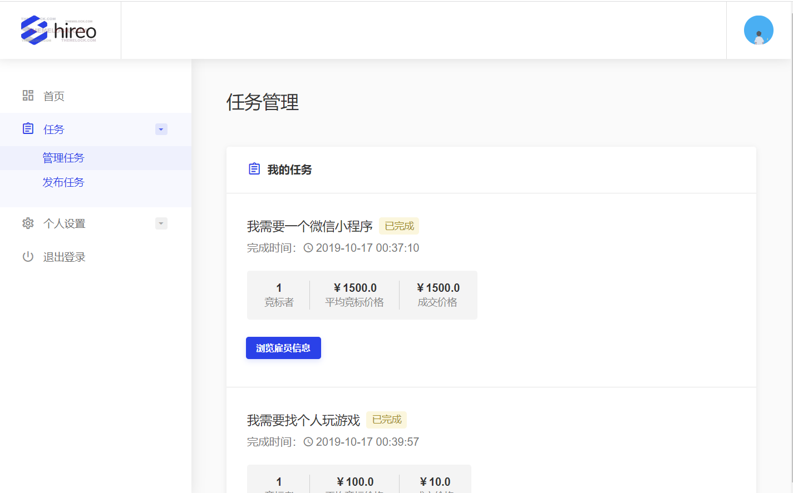
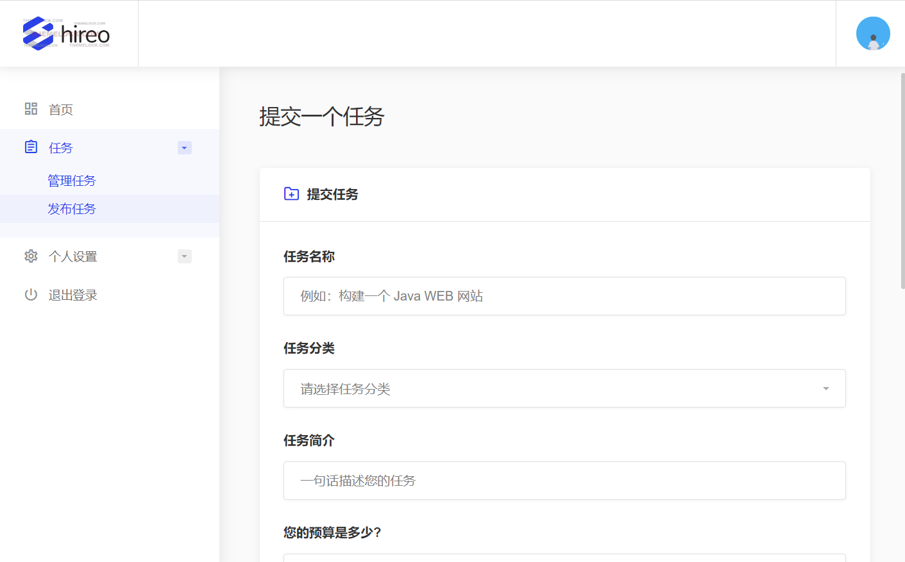
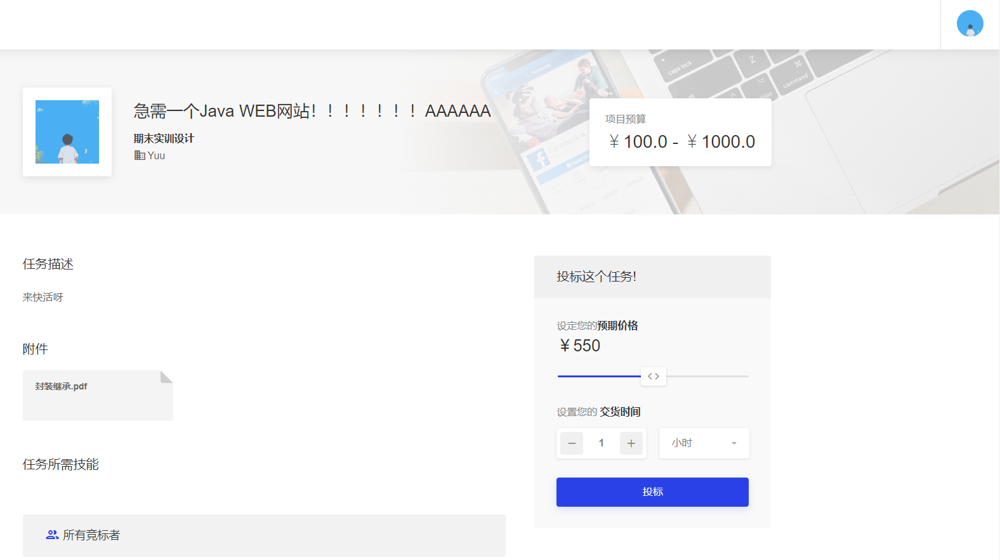
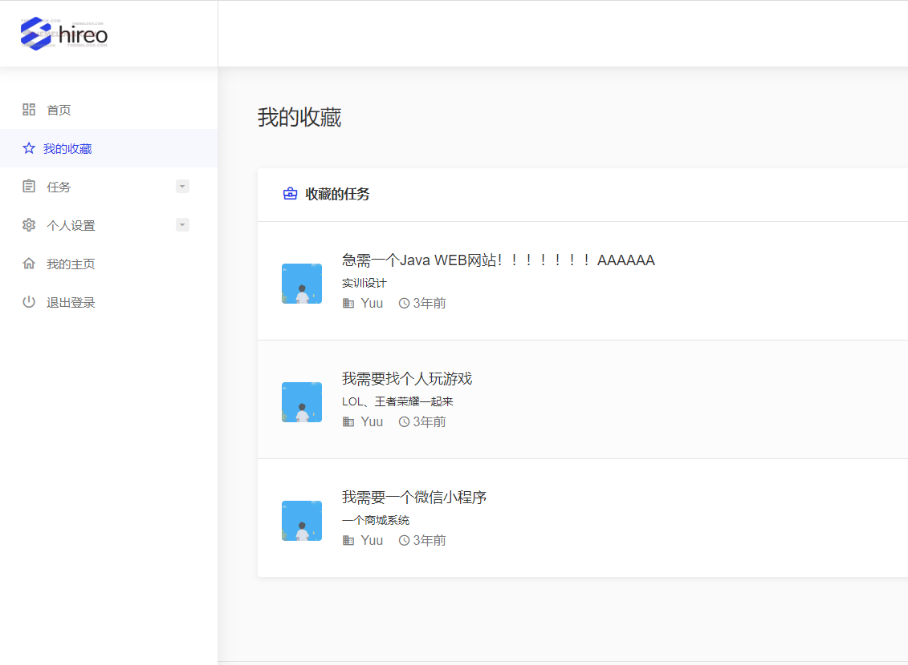
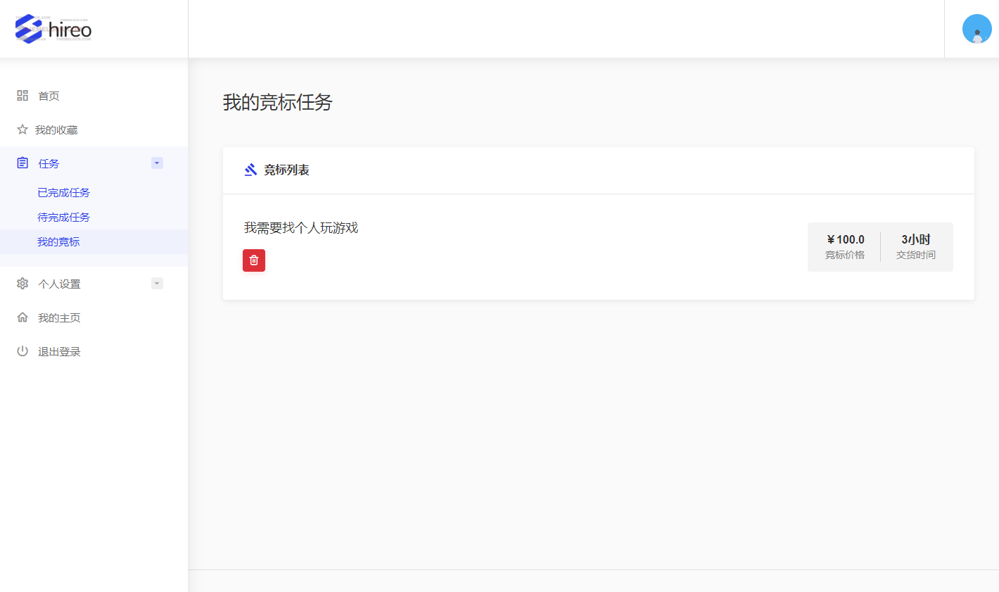
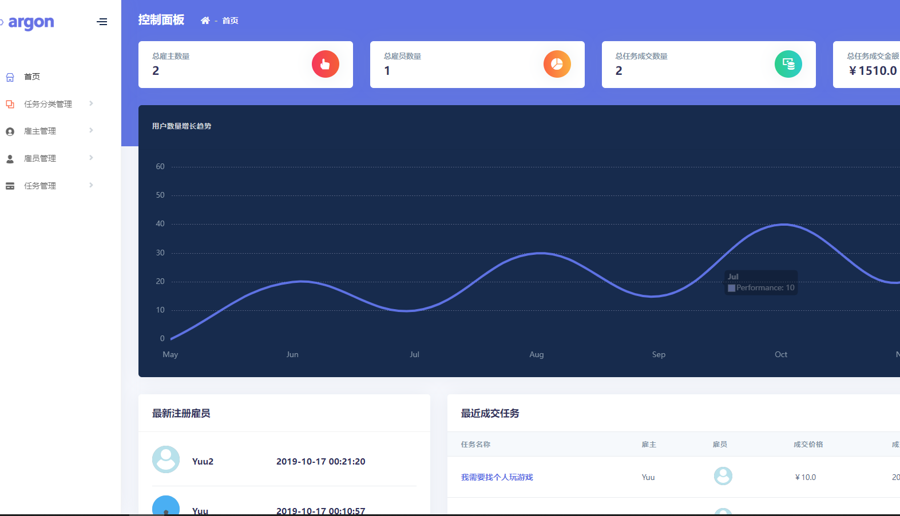
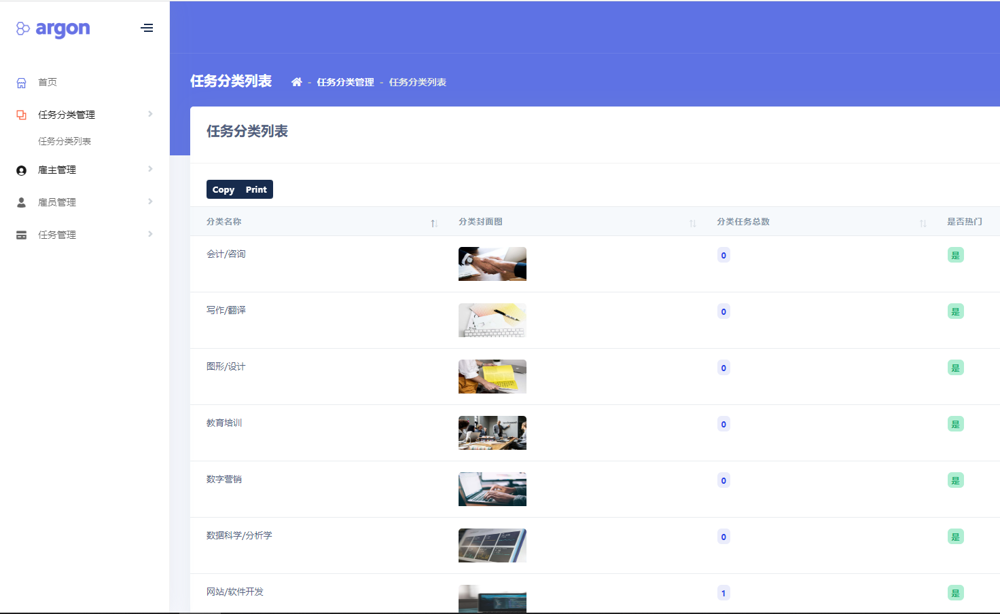
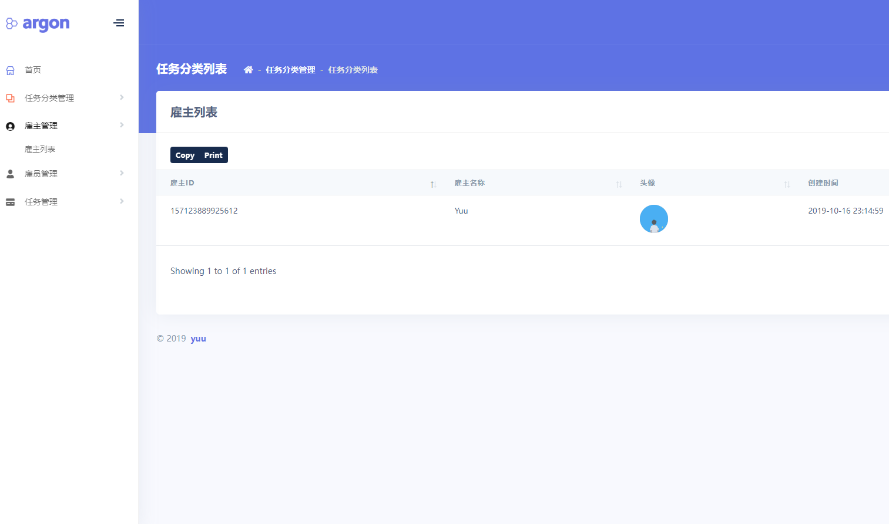
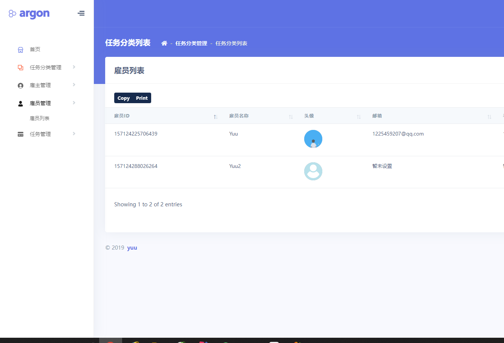
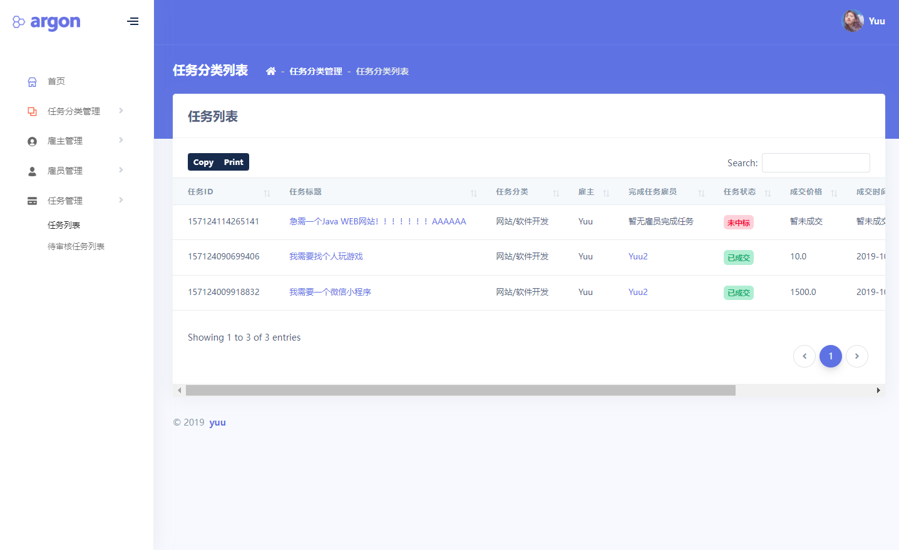

<h1 align="center">基于Java+Springboot + Thymeleaf 的招聘网站</h1>

- <b>完整代码获取地址：从戎源码网 ([https://armycodes.com/](https://armycodes.com/))</b>
- <b>技术探讨、资料分享，请加QQ群：692619798</b> 
- <b>作者微信：19941326836  QQ：952045282</b> 
- <b>承接计算机毕业设计、Java毕业设计、Python毕业设计、深度学习、机器学习</b>
- <b>选题+开题报告+任务书+程序定制+安装调试+论文+答辩ppt 一条龙服务</b>
- <b>所有选题地址 ([https://github.com/YuLin-Coder/AllProjectCatalog](https://github.com/YuLin-Coder/AllProjectCatalog)) </b>

## 一、系统介绍

- 雇主：登录、注册、发布任务、选择中标雇员、评价雇员
- 雇员：登录、注册、查看任务列表、投标任务、收藏任务、完成任务
- 管理员、登录、任务管理、雇主管理、雇员管理

## 二、所用技术

后端技术栈：

- springboot
- mybatis
- mysql

前端技术栈：

- Thymeleaf 

## 三、环境介绍

基础环境 :IDEA/eclipse, JDK 1.8, Mysql5.7及以上,Maven

所有项目以及源代码本人均调试运行无问题 可支持远程调试运行

## 四、项目截图

  

  

## 五、浏览地址

- 管理员 用户名： Yuu  密码：123456  登录地址：localhost:8080/admin/login
- 雇主   用户名： Yuu  密码：123456  登录地址：http://localhost:8118/index
- 雇员   用户名： Yuu  密码：123     登录地址：http://localhost:8118/index

## 六、安装教程

1. 使用Navicat或者其它工具，在mysql中创建对应名称的数据库，执行数据库脚本 `sql/recruit.sql`
2. 使用IDEA/Eclipse导入项目，若为maven项目请选择maven;导入成功后请执行maven clean;maven install命令，然后运行；
3. 修改application.yml 里面的数据库配置
4. 启动项目后端项目 
